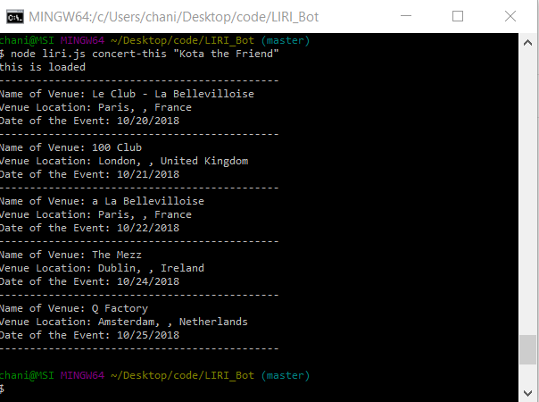
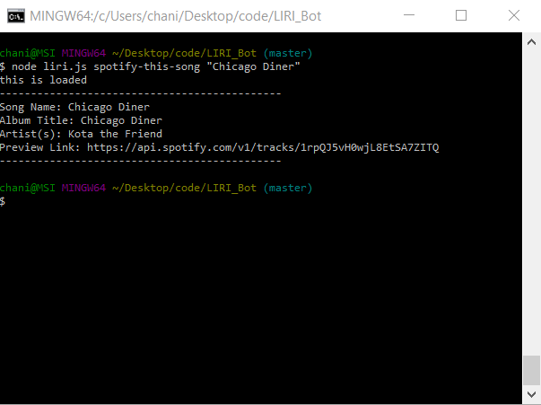
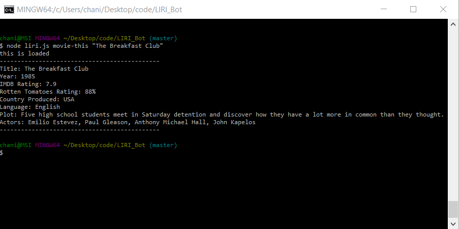
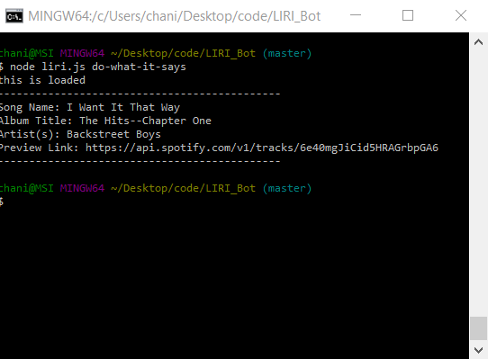

# LIRI_Bot
a Language Interpretation and Recognition Interface. LIRI will be a command line node app that takes in parameters and gives you back data based on what type of API you want to use to search, and the content in which you want to find out more information about.

## COMMANDS:

1. **concert-this:** This will search the Bands in Town Artist Events API for an artist and render future concert information.

1. **spotify-this-song:** This will search the Spotify API for an artist and render relevant information about the song.

1. **movie-this:** This will search the OMDB API for a movie by Title and render information pertaining to that movie.

1. **do-what-it-says:** This will read a .txt file with a command and content to search for, seperated by a comma. After reading the command and content to search for, it goes and applies the appropriate function to the command, and uses the content to search with.

